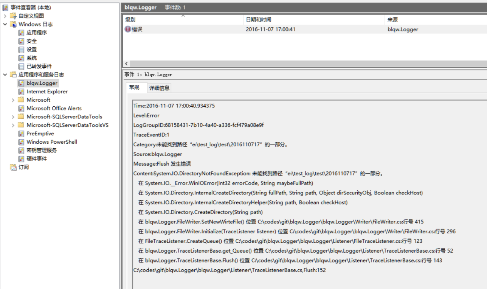
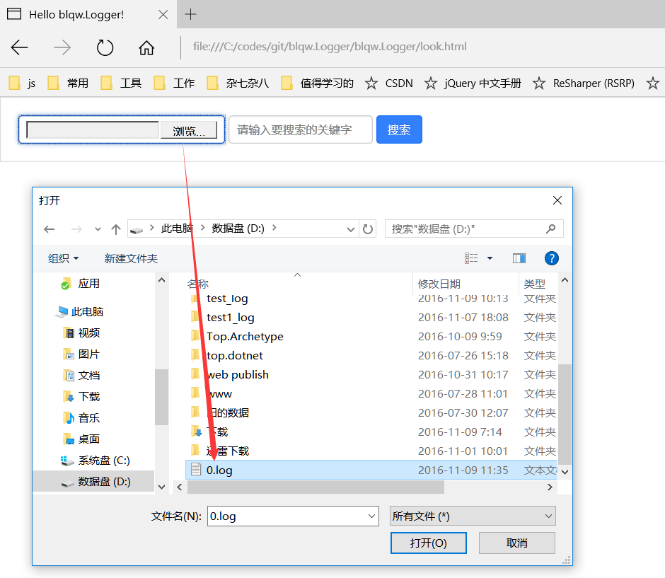
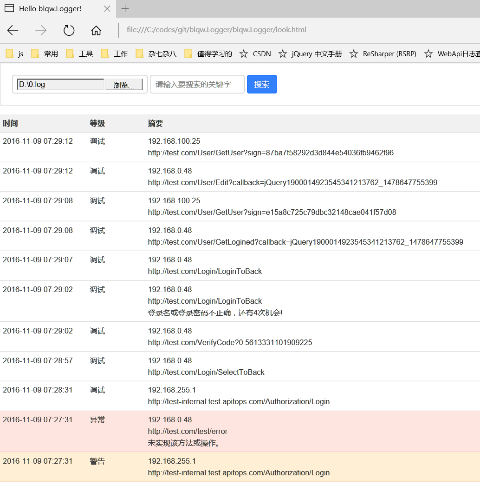
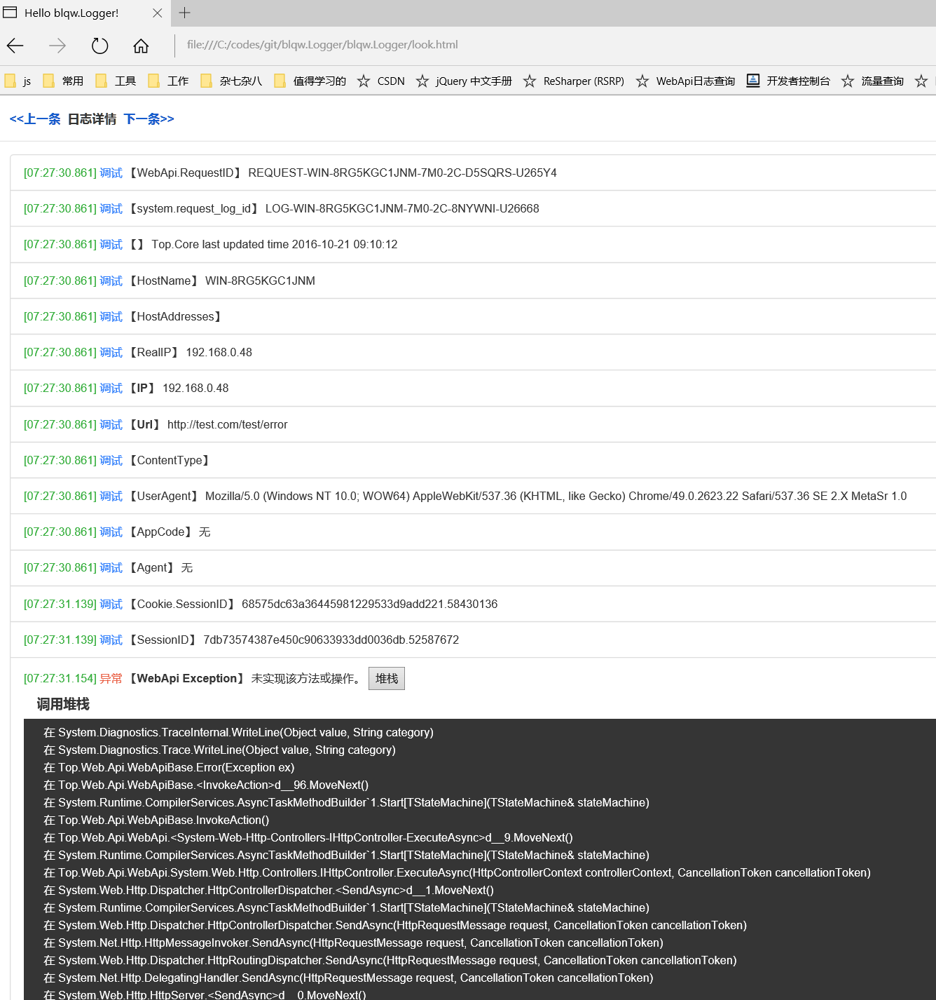
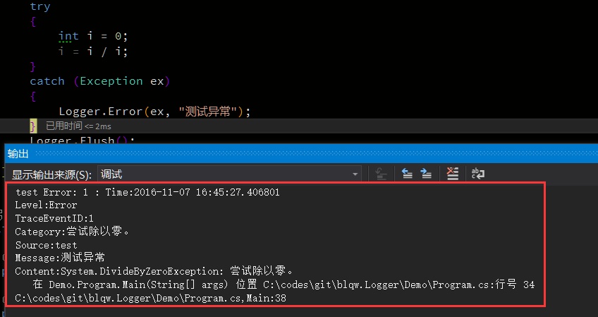

# blqw.Logger
基于微软 System.Diagnostics.TraceListener 封装

## 配置文件说明
[MSDN说明](https://msdn.microsoft.com/query/dev14.query?appId=Dev14IDEF1&l=ZH-CN&k=k(http%3A%2F%2Fschemas.microsoft.com%2F.NetConfiguration%2Fv2.0%23configuration%2Fsystem.diagnostics);k(http%3A%2F%2Fschemas.microsoft.com%2F.NetConfiguration%2Fv2.0%23system.diagnostics);k(http%3A%2F%2Fschemas.microsoft.com%2F.NetConfiguration%2Fv2.0%23configuration);k(vs.xmleditor);k(TargetFrameworkMoniker-.NETFramework,Version%3Dv4.5)&rd=true)
```xml
<system.diagnostics>
  <trace autoflush="false" useGlobalLock="false">
    <listeners>
      <clear /> <!-- 清除默认侦听器 -->
      <add name"logger1" type="FileTraceListener, blqw.Logger" initializeData="d:\test_logs" />
    </listeners>
  </trace>
</system.diagnostics>
```
监听器属性说明
* `type` : (必须)侦听器类型,FileTraceListener或其子类
* `initializeData` : 日志写入器的类型，默认"blqw.Logger.FastFileWriter, blqw.Logger"
* `queueMaxCount` : 队列中的最大数量，默认 1000万 [限制不能小于100]
* `batchMaxCount` : 批处理最大数量，默认2000 [限制不能小于1]
* `batchMaxWait` : 批处理最大等待时间(单位:秒)，默认10 [限制不能小于1]
* `level` : 跟踪日志等级(选填,默认为All,可选值参考System.Diagnostics.SourceLevels属性)
* `directoryPath` : 日志文件所在文件夹路径，默认当前文件夹如果是bin目录，则在上级，否则在当前目录
* `fileMaxSize` : 日志文件限制大小(单位:字节),默认 5*1024*1024 (5M) [限制1MB~1GB]
* `fileRetentionDays` : 文件保留天数，默认2 [限制不能小于1]

## 日志组件内置日志
记录日志组件自身的日志信息,默认只记录异常(`Error`),可以由开关调整默认记录等级
```xml
<switches>
    <add name="blqw.Logger" value="Off"/> <!-- 禁用组件内置日志 可选值参考System.Diagnostics.SourceLevels属性-->
</switches>
```

**内置日志输出到系统事件，需要管理员权限**  
添加配置
```xml
<system.diagnostics>
  <sources>
    <source name="blqw.Logger" switchValue="Warning"> <!-- 修改组件本身异常记录的跟踪,可以忽略, switchValue默认为Error -->
      <listeners> <!-- 默认组件自身异常记录到本地文件,此处修改默认行为 -->
        <clear />
        <add name="blqw.Logger" type="SystemLogTraceListener, blqw.Logger" />  <!-- 写入系统事件,需要管理员权限 -->
      </listeners>
    </source>
  </sources>
</system.diagnostics>
```


## 性能
本地测试500线程 每个线程循环1000次 每次写入100条日 共5000万条日志  
测试机配置: i7 6700k 内存ddr4 3200 32G 硬盘 希捷 1T w:100,r:150 ,缓存队列 5000万  
压入日志耗时:73s 全部写完耗时:250s  
压入日志CPU:50\~60% 写日志CPU:20\~30%  
内存峰值:2700Mb 日志量:2.64G 文件数:539 硬盘写入:11mb/秒  
写入日志:20万条/s

## 关于预定义格式SLS日志
### 配置文件
```xml
<system.diagnostics>
  <trace autoflush="false" useGlobalLock="false">
    <listeners>
      <clear /> <!-- 清除默认侦听器 -->
      <add name"logger1" type="SLSTraceListener, blqw.Logger" initializeData="d:\sls_logs" level="Error" />
    </listeners>
    <switches>
      <add name="blqw.Logger" value="0"/> <!-- 禁用组件内置日志 -->
    </switches>
  </trace>
</system.diagnostics>
```
### 页面查看
下载2个文件到本地测试效果  
[页面](http://blqw-1251195077.cossh.myqcloud.com/look.html)  
[日志文件](http://blqw-1251195077.cossh.myqcloud.com/0.log)  




### 使用 logstash 抓取日志
logstash2.2.2 配置 cvs.conf
``` 
input {
    file {
        type => "csv_log_1"
        path => ["根据web.config中日志的输出位置填写/*/*/*.log"]
        start_position => "beginning"
    }
}
filter {
    if [type] == "csv_log_1" {
        csv {
            separator => ","
            columns => ["time", "uid", "level", "topic", "content", "search"]
        } 
    }
}
output {
    if [type] == "csv_log_1" {
        logservice {
            codec => "json"
            endpoint => "cn-hangzhou-vpc.log.aliyuncs.com" //可能会有变化
            project => "webapi-log2" //可能会有变化
            logstore => "cvs_log" //可能会有变化
            topic => ""
            source => ""
            access_key_id => "根据实际情况填写"
            access_key_secret => "根据实际情况填写"
            max_send_retry => 10
        }
    }
}
```
## 关于自定义文件写入格式
### 自定义文件写入
```csharp
public class MyLogWriter : FileWriter
{
    public MyLogWriter() { }

    public MyLogWriter(string dir)
    {
        DirectoryPath = dir;
    }

    /// <summary>
    /// 追加日志
    /// </summary>
    /// <param name="item"> </param>
    public override void Append(LogItem item)
    {
        if (!item.IsFirst && !item.IsLast)
        {
            base.Append(item.ToJsonString());
            base.AppendLine();
        }
    }
}
```

### 手写代码实例化监听器
```csharp
private static TraceSource Logger { get; } = InitLogger();

private static TraceSource InitLogger()
{
    var logger = new TraceSource("test", SourceLevels.All);
    logger.Listeners.Clear();
    logger.Listeners.Add(new FileTraceListener(new MyLogWriter("d:\\test_logs")));
    return logger;
}
```
### 使用配置文件实例化监听器
```xml
<system.diagnostics>
    <sources>
        <source name="blqw.Logger" switchValue="Warning">
            <listeners>
                <add name="test1" type="FileTraceListener, blqw.Logger" directoryPath="d:\test_log"     initializeData="Demo.MyLogWriter,Demo" />
            </listeners>
        </source>
    </sources>
    <trace autoflush="false" useGlobalLock="false">
        <listeners>
            <add name="test2" type="FileTraceListener, blqw.Logger" directoryPath="d:\test_log"     initializeData="Demo.MyLogWriter,Demo" />
        </listeners>
    </trace>
</system.diagnostics>

```

## 关于`TraceSource`拓展方法
```csharp
var Logger = new TraceSource("test",TraceEventType.All);
Logger.Log(TraceEventType.Verbose, "测试"); //日志等级自定义
Logger.Debug(TraceEventType.Verbose, "测试"); //日志等级自定义  [Conditional("DEBUG")]
Logger.Log("测试"); //等级=Verbose
Logger.Warn("测试"); //等级=Warning 
Logger.Info("测试"); //等级=Information
Logger.Error(new Exception("测试")); //等级=Error
Logger.Entry(); // 等级=Start ,进入方法
Logger.Exit(); // 等级=Stop ,离开方法
Logger.Return("1"); // 等级=Stop ,离开方法并记录返回值
```

## 关于调试
### 输出窗口
当`Debugger.IsAttached`(即进入附加进程调试模式时)，将会在输出列表中打印日志

### 输出到文件
日志从内存到文件有一个延迟时间，当`N`秒无操作或缓存日志操作`M`条时输出到文件  
`N`由属性`batchMaxWait`控制，`M`由属性`batchMaxCount`控制  
但当`Debugger.IsAttached`时，`batchMaxWait`强制设置为`1`（1秒无日志输出到文件）  

## 更新日志
### [1.3.4] 2016.11.09
* 修复一些不合理的设置
* 修复若干预览版的bug
* 优化日志查看页面

### [1.3.2-beta] 2016.11.07
* 修正拓展方法签名不合理的地方

### [1.3.1-beta] 2016.11.04
* 优化SLS日志警告以上的提示
* 修复异常记录可能会丢失message的问题
* 加入查看日志的页面`look.html`

### [1.3.0-beta] 2016.11.02
* 允许很方便的自定义文件写入操作

### [1.2.11] 2016.10.26
* 修正第一次并发时会生成多个空白日志的问题

### [1.2.10] 2016.10.07
* 修正一个类的命名错误问题

### [v1.2.9] 2016.09.29
* 修复异常日志输出格式错误的问题
* 修复`useGlobalLock=true`时不输出日志的问题

### [v1.2.8] 2016.09.23
* 优化日志输出

### [v1.2.7] 2016.09.22
* 修复bug
* 正式版

### [v1.2.6] 2016.09.21
* 优化代码
* 修复SLS异步刷新异常不会记录的问题

### [v1.2.5] 2016.09.20
* 优化代码

### [v1.2.4] 2016.09.19
* 修复SLS日志索引丢失的问题

### [v1.2.3] 2016.09.19
* 优化系统事件日志的显示

### [v1.2.2] 2016.09.19
* 修复sls日志输出等级为字符串的问题(应该为数字)

### [v1.2] 2016.09.19
* 增加输出到系统事件的日志侦听器

### [v1.1] 2016.09.18
* 优化日志组件异常时的本地log输出
* 优化日志输出到文件的方式
* 优化代码,完善注释

### [v1.0] 2016.09.13
* 初始版本